# Flujo de Trabajo Terraform Apply - Diagrama de Actividades

## 📋 Descripción General

Este documento describe el flujo completo de actividades del workflow `terraform-apply.yml` de GitHub Actions, que despliega la infraestructura en fases secuenciales después de que un Pull Request es mergeado.

## 🎯 Propósito

- **Despliegue**: Aplicar cambios de infraestructura de forma controlada
- **Fases Secuenciales**: Desplegar en 5 fases ordenadas para manejar dependencias
- **Backup Automático**: Respaldar estado después de cada fase
- **Validación**: Verificar estado final de la infraestructura

## 🔄 Diagrama de Actividades

```mermaid
graph TD
    A[Pull Request Mergeado] --> B{Rama Destino?}
    B -->|dev/test/staging/main| C[Activar terraform-apply.yml]
    B -->|otra rama| Z[Omitir Workflow]
    
    C --> D[Configurar Runner Ubuntu]
    D --> E[Descargar Código]
    E --> F[Instalar Terraform 1.5.0]
    
    F --> G[Establecer Variable de Entorno]
    G --> H{Entorno == 'dev'?}
    
    H -->|Sí| I[Instalar y Configurar OCI CLI]
    H -->|No| M[Omitir Configuración OCI CLI]
    
    I --> J[Verificar si Bucket Existe]
    J --> K{Bucket Existe?}
    
    K -->|Sí| M[Continuar con Fases]
    K -->|No| L[Crear Bucket]
    L --> M
    
    M --> N[Reemplazar Tokens con Secrets]
    N --> O[Configurar Autenticación Backend]
    O --> P[Terraform Init]
    
    P --> Q[FASE 1: Fundamentos]
    Q --> Q1[iam, vault, ocir]
    Q1 --> Q2[Backup Estado Fase 1]
    
    Q2 --> R[FASE 2: Red y Seguridad]
    R --> R1[networking, waf]
    R1 --> R2[Backup Estado Fase 2]
    
    R2 --> S[FASE 3: Infraestructura Core]
    S --> S1[database, k8s_cluster]
    S1 --> S2[Backup Estado Fase 3]
    
    S2 --> T[FASE 4: Servicios de Red]
    T --> T1[load_balancer, dns]
    T1 --> T2[Backup Estado Fase 4]
    
    T2 --> U[FASE 5: Monitoreo]
    U --> U1[monitoring]
    U1 --> U2[Backup Estado Fase 5]
    
    U2 --> V[Apply Final Completo]
    V --> W[Validar Estado Final]
    W --> X[Workflow Exitoso]
```



## 📊 Proceso Detallado Paso a Paso

### 1. Condiciones de Activación
```yaml
Activador: Pull Request Mergeado
├── pull_request.closed (PR cerrado)
└── merged == true (debe estar mergeado)

Ramas Objetivo:
├── dev → environment=dev
├── test → environment=test  
├── staging → environment=staging
└── main → environment=prod
```

**Detalles de Activación:**
- **Evento Específico**: Solo se ejecuta cuando un PR es mergeado, no cerrado sin merge
- **Validación de Merge**: Verifica `github.event.pull_request.merged == true`
- **Filtro de Ramas**: Solo ramas principales para evitar despliegues accidentales
- **Seguridad**: Requiere que el PR haya pasado todas las verificaciones previas
- **Timing**: Se ejecuta inmediatamente después del merge

### 2. Configuración del Entorno
```bash
Runner: ubuntu-latest (Ubuntu 22.04 LTS)
Timeout: 60 minutos (máximo total)
Terraform: v1.5.0 (versión fija)
Recursos: 7GB RAM, 14GB SSD, 2 vCPUs
Estrategia: max-parallel: 1 (secuencial)
```

**Detalles de Configuración:**
- **Timeout Extendido**: 60 minutos para permitir despliegues complejos
- **Ejecución Secuencial**: `max-parallel: 1` asegura orden de fases
- **Recursos Dedicados**: Cada fase usa recursos completos del runner
- **Consistencia**: Misma versión de Terraform que terraform-plan
- **Aislamiento**: Cada ejecución en entorno limpio

### 3. Detección de Entorno
```bash
Entrada: github.event.pull_request.base.ref
Salida: steps.set-env.outputs.environment

Mapeo de Ramas:
├── dev → environment=dev (desarrollo)
├── test → environment=test (pruebas)
├── staging → environment=staging (pre-producción)
└── main → environment=prod (producción)
```

**Detalles de Detección:**
- **Lógica Idéntica**: Mismo mapeo que terraform-plan para consistencia
- **Variable Compartida**: Usada por todos los steps posteriores
- **Validación**: Solo procesa ramas conocidas
- **Configuración**: Determina directorio y configuración específica
- **Trazabilidad**: Logs claros sobre entorno detectado

### 4. Configuración de OCI CLI (Solo Dev)
```bash
Condición: if environment == 'dev'
Acciones:
├── pip3 install oci-cli (instalación vía pip)
├── mkdir -p ~/.oci (crear directorio)
├── Crear ~/.oci/config con secrets
├── Crear ~/.oci/oci_api_key.pem
└── Establecer permisos (600)

Variables de Entorno:
└── SUPPRESS_LABEL_WARNING: true (suprimir warnings)
```

**Detalles de Configuración OCI CLI:**
- **Optimización**: Solo en dev para reducir tiempo en otros entornos
- **Instalación Rápida**: pip3 es más rápido que script oficial
- **Configuración Estándar**: Formato compatible con OCI CLI oficial
- **Seguridad**: Permisos restrictivos en archivos de clave
- **Warnings**: Suprimidos para logs más limpios
- **Timeout**: 5 minutos máximo para instalación

### 5. Verificación y Creación de Bucket (Solo Dev)
```bash
Verificación:
├── Comando: oci os bucket get --bucket-name {BUCKET}
├── Resultado: bootstrap_needed=true/false
└── Timeout: 10 minutos

Creación (si es necesario):
├── Comando: oci os bucket create
├── Parámetros: --public-access-type ObjectRead --versioning Enabled
├── Resilencia: continue-on-error: true
└── Timeout: 5 minutos
```

**Detalles de Gestión de Bucket:**
- **Verificación Primero**: Evita intentos de creación innecesarios
- **Creación Condicional**: Solo si no existe
- **Configuración Específica**: Acceso público de lectura para HTTP backend
- **Versionado**: Habilitado para historial de estados
- **Tolerancia a Fallos**: Continúa aunque falle la creación
- **Logging Detallado**: Mensajes claros sobre estado del bucket

### 6. Reemplazo de Tokens
```bash
Propósito: Reemplazar tokens placeholder con secrets reales
Directorio: environments/oci/{environment}/
Método: Creación directa de terraform.tfvars

Tokens Reemplazados:
├── tenancy_ocid → OCI_TENANCY_OCID
├── user_ocid → OCI_USER_OCID
├── fingerprint → OCI_FINGERPRINT
├── compartment_id → OCI_COMPARTMENT_ID
├── db_admin_password → DB_ADMIN_PASSWORD
├── namespace → OCI_NAMESPACE
├── bucket_name → OCI_BUCKET_NAME
├── region → OCI_REGION
└── private_key → OCI_PRIVATE_KEY (formato heredoc)
```

**Detalles de Reemplazo:**
- **Método Simplificado**: Crea archivo completo en lugar de reemplazos sed
- **Formato Heredoc**: Manejo seguro de clave privada multilínea
- **Validación**: Todos los secrets deben estar presentes
- **Seguridad**: Secrets nunca aparecen en logs
- **Consistencia**: Mismo formato para todos los entornos
- **Limpieza**: No requiere archivos temporales

### 7. Configuración de Autenticación Backend
```bash
Variables de Entorno:
├── TF_HTTP_USERNAME → OCI_USER_OCID
└── TF_HTTP_PASSWORD → OCI_AUTH_TOKEN

Propósito: Autenticación HTTP para backend remoto
Alcance: Disponible para todos los comandos terraform
```

**Detalles de Autenticación:**
- **Backend HTTP**: Terraform accede al estado vía HTTP a Object Storage
- **Credenciales**: Usuario y token de autenticación de OCI
- **Persistencia**: Variables disponibles para toda la sesión
- **Seguridad**: Credenciales manejadas de forma segura
- **Validación**: Terraform valida durante init

### 8. Inicialización de Terraform
```bash
Comando: terraform init -no-color
Timeout: 15 minutos
Propósito:
├── Descargar providers de OCI
├── Configurar backend HTTP
├── Conectar con estado remoto
└── Validar configuración

Error Handling: continue-on-error: false (crítico)
```

**Detalles de Inicialización:**
- **Timeout Extendido**: 15 minutos para descargas lentas
- **Backend Remoto**: Conecta con bucket de Object Storage
- **Providers**: Descarga versiones específicas de providers
- **Validación**: Verifica sintaxis y configuración
- **Estado**: Lee estado existente del bucket
- **Crítico**: Fallo detiene todo el workflow

### 9. Estrategia de Fases Secuenciales
```bash
Configuración: max-parallel: 1 (una fase a la vez)
Total de Fases: 5 fases ordenadas

Fase 1 - Fundamentos:
├── iam (políticas y usuarios)
├── vault (gestión de secretos)
└── ocir (registro de contenedores)

Fase 2 - Red y Seguridad:
├── networking (VCN, subnets, gateways)
└── waf (Web Application Firewall)

Fase 3 - Infraestructura Core:
├── database (PostgreSQL)
└── k8s_cluster (cluster OKE)

Fase 4 - Servicios de Red:
├── load_balancer (balanceador de carga)
└── dns (zonas DNS)

Fase 5 - Monitoreo:
└── monitoring (monitoreo y alertas)
```

**Detalles de Estrategia de Fases:**
- **Orden de Dependencias**: Fases ordenadas por dependencias lógicas
- **Ejecución Secuencial**: Una fase completa antes de la siguiente
- **Manejo de Errores**: continue-on-error: true para resilencia
- **Timeout por Fase**: 35 minutos máximo por fase
- **Caso Especial K8s**: Solo cluster, node pools excluidos del pipeline
- **Flexibilidad**: Fácil modificar módulos por fase

### 10. Procesamiento de Módulos por Fase
```bash
Proceso por Módulo:
├── Verificar si ya existe en estado
├── Si existe → Omitir (ya desplegado)
├── Si no existe → Aplicar módulo
└── Manejar errores graciosamente

Comando Apply:
├── Estándar: terraform apply -target=module.{módulo}
├── K8s: terraform apply -target=module.k8s_cluster.oci_containerengine_cluster.oke
├── Parámetros: -input=false -no-color -auto-approve
└── Logging: Salida guardada en apply.log
```

**Detalles de Procesamiento:**
- **Verificación Previa**: `terraform state list` para verificar existencia
- **Idempotencia**: Omite módulos ya desplegados
- **Targeting**: Aplica solo el módulo específico
- **Auto-aprobación**: `-auto-approve` para ejecución no interactiva
- **Logging**: Captura salida para análisis de errores
- **Manejo de Errores**: Lógica específica por tipo de error

### 11. Manejo de Errores por Módulo
```bash
Errores Manejados Graciosamente:
├── "already exists" → Recurso ya existe
├── "LimitExceeded" → Límites de tenancy alcanzados
├── "AlreadyExists" → Recurso duplicado
├── "PolicyAlreadyExists" → Política ya existe
├── "database named.*already exists" → Base de datos existe
├── "Limit.*has been already reached" → Límite alcanzado
├── "Work Request error" → Error de OCI Work Request
└── "work request did not succeed" → Work Request falló

Manejo Específico por Módulo:
├── database → Omitir si existe o límite alcanzado
├── load_balancer → Omitir si límite IP alcanzado
├── vault → Omitir si existe o límite alcanzado
├── k8s_cluster → Omitir si falla (intervención manual)
└── otros → Refresh y continuar
```

**Detalles de Manejo de Errores:**
- **Patrones de Error**: Regex para detectar errores conocidos
- **Graceful Degradation**: Continúa con otros módulos
- **Logging Específico**: Mensajes claros sobre por qué se omite
- **Refresh**: Actualiza estado para recursos existentes
- **Intervención Manual**: Algunos casos requieren revisión manual
- **Resilencia**: Workflow no falla por errores individuales

### 12. Backup Automático de Estado
```bash
Condición: if environment == 'dev'
Proceso:
├── terraform state pull → Descargar estado actual
├── Verificar contenido del archivo
├── Generar timestamp único
├── Subir a bucket con nombre específico
└── Limpiar archivos temporales

Formato de Nombre:
{environment}_phase{número}_{YYYYMMDD_HHMMSS}.tfstate

Ejemplo:
dev_phase1_20241124_143022.tfstate
```

**Detalles de Backup:**
- **Solo Dev**: Optimización para reducir tiempo en otros entornos
- **Después de Cada Fase**: Backup inmediato tras completar fase
- **Verificación de Contenido**: Solo sube si el archivo tiene contenido
- **Timestamp Único**: Evita conflictos de nombres
- **Trazabilidad**: Fácil identificar qué fase generó cada backup
- **Limpieza**: Elimina archivos temporales para seguridad

### 13. Apply Final Completo
```bash
Condición: if matrix.phase == 5 (solo en última fase)
Comando: terraform apply -input=false -no-color -auto-approve
Propósito:
├── Capturar dependencias perdidas
├── Aplicar recursos no targetados
├── Sincronizar estado final
└── Validación completa

Timeout: 20 minutos
Error Handling: continue-on-error (no crítico)
```

**Detalles de Apply Final:**
- **Solo Última Fase**: Ejecuta una vez al final de todas las fases
- **Sin Targeting**: Aplica toda la configuración
- **Dependencias**: Captura recursos con dependencias complejas
- **Sincronización**: Asegura consistencia del estado final
- **No Crítico**: Fallo no detiene el workflow
- **Validación**: Confirma que todo está desplegado correctamente

### 14. Validación de Estado Final
```bash
Job Separado: validate-state
Dependencia: needs: apply
Condición: if: always() (ejecuta siempre)

Proceso:
├── Configurar entorno
├── Reemplazar tokens
├── Configurar autenticación backend
├── terraform init
├── terraform validate
├── terraform state list
└── Reportar resultados
```

**Detalles de Validación:**
- **Job Independiente**: Ejecuta en runner separado
- **Siempre Ejecuta**: Incluso si apply falla
- **Configuración Completa**: Replica configuración de apply
- **Validación Dual**: Sintaxis y estado
- **Manejo de Errores**: Gracioso si no hay estado
- **Reporte**: Confirma éxito o identifica problemas

## 🔍 Puntos de Decisión Críticos

### Ejecución Secuencial vs Paralela
```bash
Decisión: max-parallel: 1
Razón: Evitar conflictos de estado de terraform
Beneficios:
├── Estado consistente
├── Dependencias respetadas
├── Debugging más fácil
└── Rollback más controlado

Desventaja:
└── Tiempo total mayor
```

### Backup Solo en Dev
```bash
Decisión: Backup solo en environment == 'dev'
Razones:
├── Dev es entorno de prueba principal
├── Optimización de tiempo en otros entornos
├── Bucket compartido entre entornos
└── Estados separados por archivo

Alternativa: Backup en todos los entornos (configurable)
```

### Manejo de Errores Gracioso
```bash
Filosofía: continue-on-error: true
Beneficios:
├── Despliegue parcial mejor que fallo total
├── Identificación de problemas específicos
├── Posibilidad de corrección manual
└── Workflow más resiliente

Riesgo: Infraestructura parcialmente desplegada
```

## ⚡ Características de Rendimiento

### Desglose de Tiempos
```bash
Tiempo Total del Workflow: ~45-90 minutos
├── Configuración (5-10 min): Runner + Terraform + OCI CLI
├── Bootstrap (2-5 min): Verificación/creación de bucket
├── Inicialización (5-10 min): Init + configuración
├── Fase 1 (5-15 min): Fundamentos
├── Fase 2 (10-20 min): Red y seguridad
├── Fase 3 (15-25 min): Infraestructura core
├── Fase 4 (5-15 min): Servicios de red
├── Fase 5 (3-8 min): Monitoreo
└── Validación (2-5 min): Estado final
```

### Factores de Rendimiento
```bash
Variables que Afectan Tiempo:
├── Complejidad de recursos por módulo
├── Velocidad de APIs de OCI
├── Tamaño del estado existente
├── Dependencias entre recursos
└── Errores y reintentos

Optimizaciones:
├── Targeting específico por módulo
├── Verificación de existencia previa
├── Manejo gracioso de errores
└── Timeouts apropiados
```

## 🛡️ Manejo de Errores y Resilencia

### Categorías de Errores
```bash
Errores Críticos (Detienen Workflow):
├── Fallo de terraform init
├── Secrets faltantes o inválidos
├── Configuración de backend incorrecta
└── Permisos insuficientes en OCI

Errores No Críticos (Continúan):
├── Recursos ya existentes
├── Límites de tenancy alcanzados
├── Fallos de módulos individuales
└── Problemas de red temporales
```

### Estrategias de Recuperación
```bash
Recursos Existentes:
├── Detección automática vía terraform state
├── Omisión de módulos ya desplegados
├── Refresh de estado para sincronización
└── Logging claro sobre omisiones

Límites de Tenancy:
├── Detección de mensajes de límite
├── Omisión graceful del módulo
├── Sugerencias para resolución manual
└── Continuación con otros módulos

Fallos de Red:
├── Timeouts apropiados
├── Reintentos automáticos (por Terraform)
├── Logging detallado para debugging
└── Posibilidad de re-ejecución manual
```

## 📈 Criterios de Éxito

### Éxito Completo
```bash
Requerido:
├── ✅ Todas las 5 fases completadas
├── ✅ Al menos 80% de módulos desplegados exitosamente
├── ✅ Estado final validado
└── ✅ Backups creados (si aplica)

Indicadores:
├── Workflow status: success
├── Todos los jobs completados
├── Estado consistente en bucket
└── Logs sin errores críticos
```

### Éxito Parcial
```bash
Aceptable:
├── 🔄 Algunas fases completadas
├── 🔄 Módulos críticos desplegados
├── 🔄 Estado parcial pero consistente
└── 🔄 Errores documentados y manejables

Requiere:
├── Revisión manual de errores
├── Posible corrección manual
├── Re-ejecución si es necesario
└── Documentación de problemas
```

## 🔧 Configuración y Dependencias

### Secrets Requeridos (Idénticos a terraform-plan)
```bash
Autenticación OCI:
├── OCI_USER_OCID
├── OCI_TENANCY_OCID
├── OCI_FINGERPRINT
├── OCI_PRIVATE_KEY
└── OCI_AUTH_TOKEN

Configuración:
├── OCI_REGION
├── OCI_NAMESPACE
├── OCI_COMPARTMENT_ID
├── OCI_BUCKET_NAME
└── DB_ADMIN_PASSWORD
```

### Estructura de Archivos
```bash
Requerida:
├── .github/workflows/terraform-apply.yml
├── environments/oci/{env}/backend.tf
├── environments/oci/{env}/main.tf
├── environments/oci/{env}/terraform.tfvars
└── modules/{module_name}/

Generada:
├── {env}_phase{N}_{timestamp}.tfstate (backups)
├── apply.log (por módulo)
└── terraform.tfstate (estado principal)
```

## 🎯 Integración y Monitoreo

### Integración con GitHub
```bash
Eventos:
├── Activación automática en PR merge
├── Estado reportado en PR
├── Logs accesibles en Actions tab
└── Notificaciones configurables

Artefactos:
├── Logs detallados por fase
├── Estados de backup
├── Reportes de errores
└── Métricas de tiempo
```

### Monitoreo y Alertas
```bash
Métricas Clave:
├── Tiempo total de despliegue
├── Tasa de éxito por módulo
├── Frecuencia de errores
└── Uso de recursos

Alertas Recomendadas:
├── Fallos críticos de workflow
├── Timeouts excesivos
├── Errores de autenticación
└── Problemas de estado
```

## 🌟 Conclusión

Este workflow de terraform-apply proporciona un sistema robusto y controlado para el despliegue de infraestructura, con énfasis en la seguridad, trazabilidad y recuperación ante errores. La estrategia de fases secuenciales asegura que las dependencias se respeten mientras que el manejo gracioso de errores permite despliegues parciales exitosos cuando sea apropiado.

La combinación de backup automático, validación de estado y logging detallado proporciona las herramientas necesarias para mantener y debuggear la infraestructura de manera efectiva.