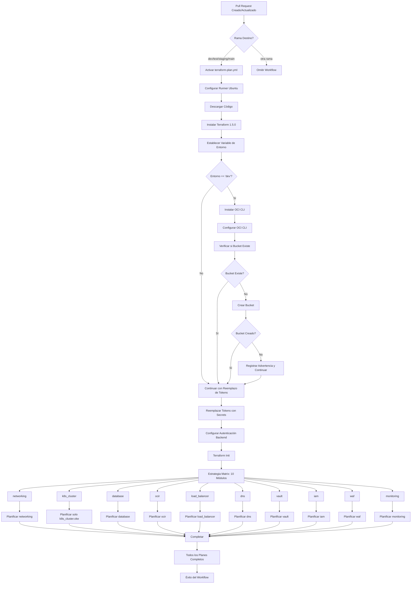

# Flujo de Trabajo Terraform Plan - Diagrama de Actividades

## 📋 Descripción General

Este documento describe el flujo completo de actividades del workflow `terraform-plan.yml` de GitHub Actions, que valida los cambios de infraestructura antes del despliegue.

## 🎯 Propósito

- **Validación**: Verificar configuraciones de terraform antes del merge
- **Bootstrap**: Auto-crear bucket de Object Storage si no existe
- **Planificación**: Generar planes de ejecución para todos los módulos
- **Seguridad**: Prevenir cambios que rompan la infraestructura

## 🔄 Diagrama de Actividades



## 📊 Proceso Detallado Paso a Paso

### 1. Condiciones de Activación
```yaml
Activador: Eventos de Pull Request
├── opened (PR nuevo)
├── synchronize (nuevos commits)
└── reopened (PR reabierto)

Ramas Objetivo:
├── dev → environment=dev
├── test → environment=test  
├── staging → environment=staging
└── main → environment=prod
```

**Detalles de Activación:**
- **opened**: Se ejecuta cuando se crea un nuevo Pull Request
- **synchronize**: Se ejecuta cuando se agregan nuevos commits al PR existente
- **reopened**: Se ejecuta cuando se reabre un PR previamente cerrado
- **Filtro de ramas**: Solo se ejecuta si el PR apunta a dev, test, staging o main
- **Validación**: Verifica que `github.event.pull_request.base.ref` coincida con las ramas permitidas

### 2. Configuración del Entorno
```bash
Runner: ubuntu-latest (Ubuntu 22.04 LTS)
Timeout: 30 minutos (máximo)
Terraform: v1.5.0 (versión fija)
Recursos: 7GB RAM, 14GB SSD, 2 vCPUs
```

**Detalles de Configuración:**
- **Runner**: Máquina virtual Ubuntu limpia para cada ejecución
- **Timeout**: Previene ejecuciones infinitas, falla después de 30 minutos
- **Terraform**: Versión específica para consistencia entre ejecuciones
- **Recursos**: Suficientes para manejar 10 módulos en paralelo
- **Aislamiento**: Cada workflow ejecuta en entorno limpio y aislado

### 3. Detección de Entorno
```bash
Entrada: github.event.pull_request.base.ref
Salida: steps.set-env.outputs.environment

Mapeo de Ramas:
├── dev → environment=dev (desarrollo)
├── test → environment=test (pruebas)
├── staging → environment=staging (pre-producción)
└── main → environment=prod (producción)
```

**Detalles de Detección:**
- **Lógica**: Script bash con condicionales if/elif/else
- **Variable de salida**: Se almacena en `$GITHUB_OUTPUT` para uso posterior
- **Validación**: Solo procesa ramas conocidas, ignora otras
- **Uso posterior**: Determina qué directorio usar en `environments/oci/{environment}/`
- **Configuración**: Cada entorno tiene su propia configuración de backend y variables

### 4. Configuración de OCI CLI (Solo Dev)
```bash
Condición: if environment == 'dev'
Acciones:
├── pip3 install oci-cli (instalación vía pip)
├── mkdir -p ~/.oci (crear directorio de configuración)
├── Crear ~/.oci/config con secrets
├── Crear ~/.oci/oci_api_key.pem
└── Establecer permisos (600)

Secrets Utilizados:
├── OCI_USER_OCID (OCID del usuario)
├── OCI_FINGERPRINT (huella digital de la clave API)
├── OCI_TENANCY_OCID (OCID del tenancy)
├── OCI_REGION (región de OCI)
└── OCI_PRIVATE_KEY (clave privada completa)
```

**Detalles de Configuración OCI CLI:**
- **Solo en Dev**: Se ejecuta únicamente cuando `environment == 'dev'` para optimizar tiempo
- **Instalación**: Usa `pip3` por ser más rápido que el script oficial de instalación
- **Configuración**: Crea archivo `~/.oci/config` con formato estándar de OCI CLI
- **Clave Privada**: Almacena la clave privada en `~/.oci/oci_api_key.pem` con permisos restrictivos
- **Seguridad**: Permisos 600 (solo lectura/escritura para el propietario)
- **Validación**: OCI CLI valida automáticamente la configuración al primer uso
- **Timeout**: 5 minutos máximo para evitar cuelgues en la instalación

### 5. Verificación de Bootstrap (Solo Dev)
```bash
Propósito: Asegurar que el bucket terraform-state existe
Comando: oci os bucket get --bucket-name {BUCKET} --namespace-name {NAMESPACE}

Resultados Posibles:
├── Bucket existe → bootstrap_needed=false
└── Bucket faltante → bootstrap_needed=true

Secrets Utilizados:
├── OCI_BUCKET_NAME (nombre del bucket)
└── OCI_NAMESPACE (namespace de Object Storage)
```

**Detalles de Verificación Bootstrap:**
- **Comando OCI**: Usa `oci os bucket get` para verificar existencia del bucket
- **Manejo de Errores**: Redirige stderr a `/dev/null` para evitar logs innecesarios
- **Variable de Estado**: Establece `bootstrap_needed` para el siguiente paso
- **Timeout**: 10 minutos máximo para la verificación
- **Fallo Controlado**: `continue-on-error: false` - debe completarse exitosamente
- **Logging**: Muestra mensajes claros sobre el estado del bucket
- **Dependencia**: Requiere que OCI CLI esté configurado correctamente

### 6. Creación de Bucket (Si es Necesario)
```bash
Condición: if environment == 'dev' && bootstrap_needed == 'true'
Comando: oci os bucket create

Parámetros:
├── --compartment-id {COMPARTMENT_ID} (compartimento destino)
├── --name {BUCKET_NAME} (nombre del bucket)
├── --namespace {NAMESPACE} (namespace de Object Storage)
├── --public-access-type ObjectRead (acceso público de lectura)
└── --versioning Enabled (versionado habilitado)

Características:
├── Acceso público de lectura (para backend HTTP)
├── Versionado habilitado (historial de estados)
└── Continuar en caso de error (resiliente)
```

**Detalles de Creación de Bucket:**
- **Condición Doble**: Solo se ejecuta si es entorno dev Y el bucket no existe
- **Acceso Público**: `ObjectRead` permite que Terraform lea el estado vía HTTP
- **Versionado**: Mantiene historial completo de cambios de estado
- **Resilencia**: `continue-on-error: true` - no falla el workflow si ya existe
- **Timeout**: 5 minutos máximo para la creación
- **Logging**: Mensajes claros de éxito, fallo o advertencia
- **Manejo de Errores**: Redirige stderr para evitar logs confusos
- **Seguridad**: Solo lectura pública, escritura requiere autenticación

### 7. Reemplazo de Tokens
```bash
Propósito: Reemplazar tokens placeholder con secrets reales
Directorio de Trabajo: environments/oci/{environment}/

Tokens Reemplazados:
├── __TENANCY_OCID__ → OCI_TENANCY_OCID
├── __USER_OCID__ → OCI_USER_OCID
├── __FINGERPRINT__ → OCI_FINGERPRINT
├── __COMPARTMENT_ID__ → OCI_COMPARTMENT_ID
├── __DB_ADMIN_PASSWORD__ → DB_ADMIN_PASSWORD
└── __PRIVATE_KEY__ → OCI_PRIVATE_KEY (formato heredoc)

Proceso:
├── Comandos sed para reemplazos simples
├── Script awk para clave privada (multilínea)
└── Limpieza de archivos temporales
```

**Detalles de Reemplazo de Tokens:**
- **Archivo Objetivo**: `terraform.tfvars` en el directorio del entorno
- **Reemplazos Simples**: Usa `sed` para tokens de una línea
- **Clave Privada**: Usa `awk` para manejar contenido multilínea con formato heredoc
- **Archivo Temporal**: Crea `terraform.tfvars.tmp` para procesamiento seguro
- **Formato Heredoc**: La clave privada se envuelve en `<<EOK...EOK`
- **Limpieza**: Elimina archivos temporales después del procesamiento
- **Seguridad**: Los secrets nunca se exponen en logs
- **Validación**: El proceso falla si algún token no se puede reemplazar

### 8. Autenticación del Backend
```bash
Propósito: Configurar credenciales para backend HTTP
Variables de Entorno:
├── TF_HTTP_USERNAME → OCI_USER_OCID
└── TF_HTTP_PASSWORD → OCI_AUTH_TOKEN

Uso: Autenticación del backend HTTP de Terraform
```

**Detalles de Autenticación del Backend:**
- **Backend HTTP**: Terraform usa HTTP para acceder al estado en Object Storage
- **Autenticación Básica**: Usuario y contraseña para acceso al bucket
- **Variables de Entorno**: Se establecen en `$GITHUB_ENV` para uso posterior
- **Seguridad**: Las credenciales se pasan de forma segura a Terraform
- **Alcance**: Disponibles para todos los comandos terraform posteriores
- **Validación**: Terraform valida las credenciales durante `terraform init`

### 9. Inicialización de Terraform
```bash
Comando: terraform init -no-color
Propósito: 
├── Descargar providers (OCI, etc.)
├── Configurar backend HTTP
├── Preparar para planificación
└── Validar configuración

Timeout: 10 minutos
Manejo de Errores: Falla el workflow si init falla
```

**Detalles de Inicialización:**
- **Descarga de Providers**: Obtiene el provider de OCI y otros necesarios
- **Configuración de Backend**: Establece conexión con Object Storage
- **Validación**: Verifica sintaxis y configuración de archivos .tf
- **Cache**: Crea directorio `.terraform/` con providers y configuración
- **Estado Remoto**: Conecta con el bucket para leer estado existente
- **Crítico**: Si falla, todo el workflow se detiene
- **Logs**: Salida sin colores para mejor legibilidad en GitHub Actions

### 10. Estrategia de Planificación Matrix
```bash
Estrategia: Ejecución paralela de 10 módulos
Módulos:
├── networking (VCN, subnets, gateways)
├── k8s_cluster (cluster OKE solamente, sin node pools)
├── database (PostgreSQL)
├── ocir (registro de contenedores)
├── load_balancer (balanceador de carga)
├── dns (zonas DNS)
├── vault (gestión de secretos)
├── iam (políticas IAM)
├── waf (Web Application Firewall)
└── monitoring (monitoreo y alertas)

Caso Especial:
k8s_cluster → Solo planifica module.k8s_cluster.oci_containerengine_cluster.oke
Otros → Planifica todo el module.{nombre}
```

**Detalles de Estrategia Matrix:**
- **Paralelismo**: Los 10 módulos se planifican simultáneamente
- **Independencia**: Cada módulo se ejecuta en su propio job
- **Eficiencia**: Reduce tiempo total de ejecución
- **Caso Especial K8s**: Solo planifica el cluster, no los node pools
- **Razón K8s**: Los node pools se manejan por separado en el pipeline
- **Recursos**: Cada job usa recursos independientes del runner
- **Fallos Aislados**: Un módulo puede fallar sin afectar otros

### 11. Planificación Individual de Módulos
```bash
Patrón de Comandos:
├── Estándar: terraform plan -target=module.{modulo}
└── K8s: terraform plan -target=module.k8s_cluster.oci_containerengine_cluster.oke

Parámetros:
├── -input=false (sin entrada interactiva)
├── -no-color (salida limpia)
└── -target= (módulo específico)

Timeout: 15 minutos por módulo
Manejo de Errores: continue-on-error=true (no falla el workflow)
```

**Detalles de Planificación Individual:**
- **Targeting**: Cada plan se enfoca en un módulo específico
- **No Interactivo**: `-input=false` previene cuelgues esperando entrada
- **Salida Limpia**: `-no-color` mejora legibilidad en logs
- **Timeout Individual**: 15 minutos por módulo para prevenir cuelgues
- **Tolerancia a Fallos**: Un módulo puede fallar sin detener otros
- **Logs Detallados**: Cada módulo genera su propio log de planificación
- **Validación**: Verifica qué recursos se crearán/modificarán/eliminarán

## 🔍 Puntos de Decisión

### Ejecución Basada en Entorno
```bash
Entorno Dev:
├── ✅ Instalación de OCI CLI
├── ✅ Verificación de existencia del bucket
├── ✅ Creación de bucket si es necesario
└── ✅ Proceso completo de bootstrap

Otros Entornos (test/staging/prod):
├── ❌ Omitir instalación de OCI CLI
├── ❌ Omitir verificaciones de bucket
├── ✅ Reemplazo de tokens
└── ✅ Solo planificación
```

**Detalles de Decisión por Entorno:**
- **Razón Dev Único**: Solo dev necesita bootstrap porque es el primer entorno
- **Optimización**: Otros entornos omiten pasos innecesarios para velocidad
- **Consistencia**: Todos los entornos usan el mismo bucket terraform-state
- **Seguridad**: Cada entorno tiene su propio archivo de estado
- **Eficiencia**: Reduce tiempo de ejecución en entornos superiores

### Lógica de Gestión de Bucket
```bash
Resultados de Verificación de Bucket:
├── Existe → Continuar normalmente
├── Faltante → Crear bucket
└── Creación falla → Registrar advertencia, continuar

Resiliencia:
├── continue-on-error: true
├── Manejo elegante de errores
└── Workflow continúa aunque falle la creación del bucket
```

**Detalles de Lógica de Bucket:**
- **Verificación Primero**: Siempre verifica antes de intentar crear
- **Creación Condicional**: Solo crea si no existe
- **Tolerancia a Fallos**: Continúa aunque la creación falle
- **Casos de Fallo**: Bucket ya existe, permisos insuficientes, límites de tenancy
- **Recuperación**: Permite creación manual del bucket si es necesario
- **Logging**: Mensajes claros para debugging

### Estrategia de Planificación de Módulos
```bash
Ejecución Paralela:
├── Los 10 módulos planifican simultáneamente
├── Independientes entre sí
├── Retroalimentación más rápida
└── Fallos individuales no detienen otros

Manejo Especial:
├── k8s_cluster → Solo recurso cluster (no node pools)
├── Otros → Planificación completa del módulo
└── Enfoque de targeting consistente
```

**Detalles de Estrategia de Módulos:**
- **Paralelismo**: Aprovecha recursos del runner para velocidad
- **Independencia**: Cada módulo tiene su propio contexto de ejecución
- **Caso K8s**: Node pools se manejan separadamente en terraform-apply
- **Targeting**: Uso consistente de `-target` para control preciso
- **Escalabilidad**: Fácil agregar/quitar módulos de la matriz

## ⚡ Características de Rendimiento

### Desglose de Tiempos
```bash
Tiempo Total del Workflow: ~15-25 minutos
├── Configuración (5 min): Runner + Terraform + OCI CLI
├── Bootstrap (2-5 min): Verificación/creación de bucket
├── Reemplazo de Tokens (1 min): Procesamiento de archivos
├── Init (3-5 min): Descarga de providers + config backend
└── Planificación (5-10 min): 10 módulos en paralelo
```

**Detalles de Rendimiento:**
- **Configuración**: Tiempo fijo independiente del tamaño del proyecto
- **Bootstrap**: Variable según si el bucket existe o no
- **Tokens**: Tiempo mínimo, procesamiento de archivos local
- **Init**: Depende de velocidad de descarga de providers
- **Planificación**: Escala con complejidad de módulos
- **Paralelismo**: Reduce tiempo total vs. ejecución secuencial

### Uso de Recursos
```bash
Runner: ubuntu-latest
├── CPU: Compartida (GitHub Actions)
├── Memoria: 7 GB
├── Almacenamiento: 14 GB SSD
└── Red: Ancho de banda alto

Paralelización:
├── 10 procesos terraform plan concurrentes
├── Cada módulo planificado independientemente
└── Estrategia matrix para eficiencia
```

**Detalles de Recursos:**
- **CPU Compartida**: Suficiente para 10 procesos terraform concurrentes
- **Memoria**: 7GB permite múltiples procesos sin problemas de memoria
- **SSD**: Acceso rápido a archivos y cache de providers
- **Red**: Descarga rápida de providers y acceso a OCI APIs
- **Escalabilidad**: Recursos adecuados para proyectos de tamaño medio-grande

## 🛡️ Manejo de Errores y Resilencia

### Modos de Fallo
```bash
Fallos Críticos (Detienen Workflow):
├── Fallo de terraform init
├── Configuración inválida
├── Secrets requeridos faltantes
└── Fallos de autenticación

Fallos No Críticos (Continúan):
├── Fallo de creación de bucket
├── Fallo de planificación de módulo individual
├── Problemas de instalación de OCI CLI
└── Advertencias de reemplazo de tokens
```

**Detalles de Modos de Fallo:**
- **Fallos Críticos**: Impiden que el workflow continúe de manera significativa
- **Terraform Init**: Sin init exitoso, no se puede planificar
- **Configuración Inválida**: Errores de sintaxis en archivos .tf
- **Secrets Faltantes**: Variables requeridas no configuradas en GitHub
- **Autenticación**: Credenciales de OCI inválidas o expiradas
- **Fallos No Críticos**: Permiten ejecución parcial del workflow

### Mecanismos de Recuperación
```bash
Creación de Bucket:
├── continue-on-error: true
├── Degradación elegante
└── Creación manual del bucket posible

Planificación de Módulos:
├── continue-on-error: true
├── Fallos independientes de módulos
└── Éxito parcial aceptable

Autenticación:
├── Múltiples mecanismos de reintento
├── Mensajes de error claros
└── Información de debugging
```

**Detalles de Recuperación:**
- **Bucket**: Si falla la creación, se puede crear manualmente
- **Módulos**: Fallos individuales no afectan otros módulos
- **Reintentos**: Algunos comandos tienen lógica de reintento incorporada
- **Logging**: Información detallada para diagnóstico
- **Rollback**: No se requiere rollback en planificación (solo lectura)

## 📈 Criterios de Éxito

### Éxito del Workflow
```bash
Requerido para Éxito:
├── ✅ Detección de entorno
├── ✅ Reemplazo de tokens
├── ✅ Terraform init
└── ✅ Al menos un plan de módulo exitoso

Opcional (Deseable):
├── 🔄 Creación de bucket (si es necesario)
├── 🔄 Todos los planes de módulos exitosos
└── 🔄 Configuración de OCI CLI (solo dev)
```

**Detalles de Criterios de Éxito:**
- **Mínimo Viable**: Workflow debe completar pasos críticos
- **Detección de Entorno**: Fundamental para determinar configuración
- **Tokens**: Sin reemplazo exitoso, terraform no puede autenticarse
- **Init**: Prerequisito para cualquier operación de terraform
- **Un Plan**: Al menos un módulo debe planificar exitosamente
- **Opcionales**: Mejoran la experiencia pero no son críticos

### Artefactos de Salida
```bash
Salidas Generadas:
├── Archivos de plan de Terraform (por módulo)
├── Resultados de validación
├── Estado de configuración
└── Logs de error (si los hay)

Integración con GitHub:
├── Verificaciones de estado de PR
├── Resúmenes de plan en comentarios
├── Indicadores de éxito/fallo
└── Logs detallados en pestaña Actions
```

**Detalles de Artefactos:**
- **Planes de Terraform**: Muestran qué cambios se aplicarán
- **Validación**: Confirma que la configuración es válida
- **Estado**: Información sobre el estado actual de la infraestructura
- **Logs**: Información detallada para debugging y auditoría
- **Integración PR**: Feedback directo en la interfaz de GitHub
- **Comentarios**: Resúmenes legibles para revisores

## 🔧 Dependencias de Configuración

### Secrets Requeridos
```bash
Autenticación:
├── OCI_USER_OCID (OCID del usuario de OCI)
├── OCI_TENANCY_OCID (OCID del tenancy)
├── OCI_FINGERPRINT (huella digital de clave API)
├── OCI_PRIVATE_KEY (clave privada completa)
└── OCI_AUTH_TOKEN (token de autenticación)

Infraestructura:
├── OCI_REGION (región de OCI, ej: sa-bogota-1)
├── OCI_NAMESPACE (namespace de Object Storage)
├── OCI_COMPARTMENT_ID (OCID del compartimento)
├── OCI_BUCKET_NAME (nombre del bucket, ej: terraform-state)
└── DB_ADMIN_PASSWORD (contraseña de admin de BD)
```

**Detalles de Secrets:**
- **Configuración**: Se configuran en GitHub → Settings → Secrets and variables → Actions
- **Seguridad**: Nunca se exponen en logs, se referencian como `${{ secrets.NAME }}`
- **Validación**: GitHub valida que existan antes de ejecutar el workflow
- **Alcance**: Disponibles para todos los steps del workflow
- **Rotación**: Se pueden actualizar sin modificar el código
- **Herencia**: Se pueden configurar a nivel de organización o repositorio

### Dependencias de Archivos
```bash
Estructura del Repositorio:
├── .github/workflows/terraform-plan.yml (este workflow)
├── environments/oci/{env}/ (configuración por entorno)
│   ├── backend.tf (configuración de backend HTTP)
│   ├── main.tf (definición de módulos)
│   └── terraform.tfvars (variables con tokens)
└── modules/ (módulos referenciados por main.tf)
```

**Detalles de Dependencias:**
- **Workflow**: Debe existir en `.github/workflows/` para ser ejecutado
- **Entornos**: Cada entorno (dev/test/staging/prod) tiene su directorio
- **Backend**: Configuración HTTP que apunta al bucket de Object Storage
- **Main**: Define qué módulos se despliegan en cada entorno
- **Variables**: Contiene tokens que se reemplazan con secrets
- **Módulos**: Código reutilizable para recursos de infraestructura

## 🎯 Puntos de Integración

### Eventos de GitHub
```bash
Activadores:
├── pull_request.opened (PR abierto)
├── pull_request.synchronize (commits agregados)
└── pull_request.reopened (PR reabierto)

Filtros de Rama:
├── dev, test, staging, main solamente
└── Otras ramas son ignoradas
```

**Detalles de Integración GitHub:**
- **Eventos**: Se activa automáticamente en eventos de PR
- **Filtrado**: Solo ramas principales para evitar ejecuciones innecesarias
- **Estado**: Actualiza el estado del PR con resultados
- **Comentarios**: Puede agregar comentarios con resúmenes de planes
- **Checks**: Aparece como verificación requerida en el PR
- **Logs**: Accesibles desde la pestaña Actions del repositorio

### Servicios Externos
```bash
Servicios de OCI:
├── Object Storage (gestión de buckets)
├── IAM (autenticación)
├── Compute (planificación de recursos)
└── Networking (planificación de VCN)

Servicios de GitHub:
├── Actions (ejecución de workflows)
├── Secrets (gestión de credenciales)
└── Integración PR (actualizaciones de estado)
```

**Detalles de Servicios Externos:**
- **OCI Object Storage**: Almacena el estado de terraform y archivos de backup
- **OCI IAM**: Autentica y autoriza operaciones en OCI
- **OCI Compute/Network**: Servicios que se planifican y despliegan
- **GitHub Actions**: Plataforma de CI/CD que ejecuta el workflow
- **GitHub Secrets**: Almacenamiento seguro de credenciales
- **GitHub PR**: Integración con el flujo de revisión de código

## 🎆 Conclusión

Este workflow proporciona capacidades integrales de validación y bootstrap, asegurando que los cambios de infraestructura sean adecuadamente planificados y validados antes del despliegue. La combinación de verificación automática de buckets, planificación paralela de módulos y manejo robusto de errores garantiza un proceso confiable y eficiente para la gestión de infraestructura como código.